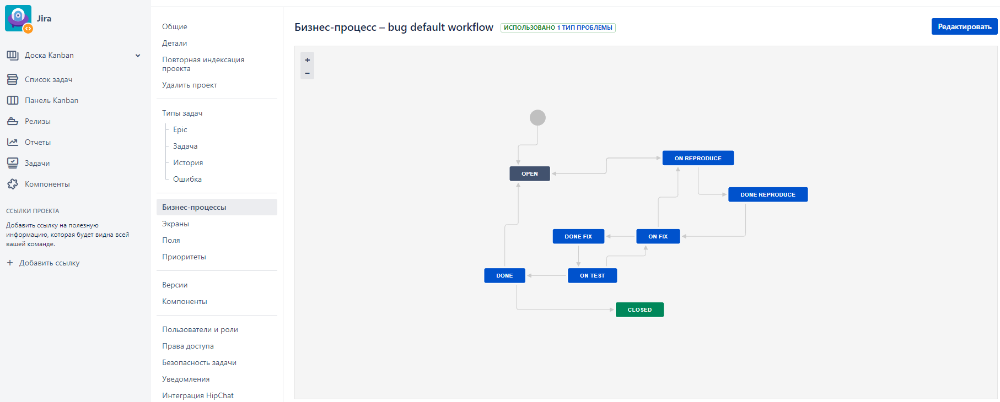
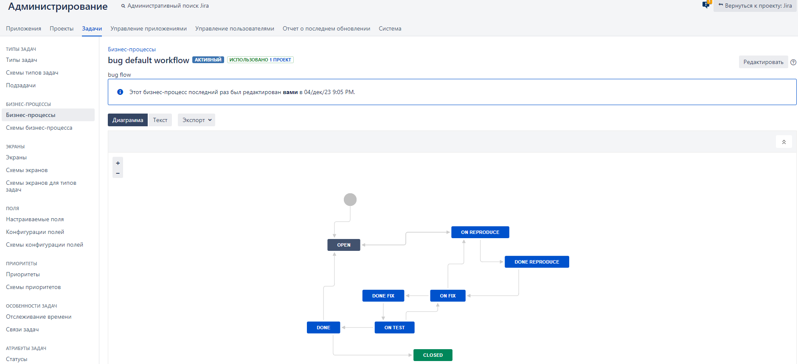
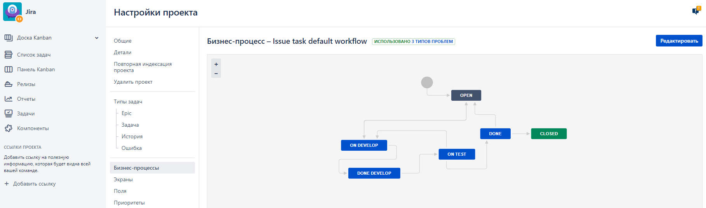
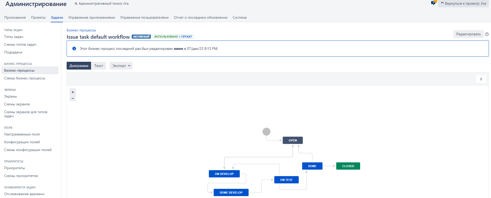

# Работа в JIRA

## Общее описание работ

1. Установлена Jira версии 8.2 на локальной машине.
2. Создан проект **Jira**
3. Создано 2 бизнес процесса и проведено перемещение 2 задач из одного эпика и одной ошибки

# Описание рабочих процессов

Разработано 2 бизнес-процесса:
1. Рабочий процесс обработки ошибок **bug default workflow**
2. Рабочий процесс обработки всех остальных типов заявок: задача, эпик и история. Рабочий процесс называется **issue task default workflow**

Вид процесса **обработки ошибок** представлен на двух скриншотах
1. Страница настройки процесса в проекте:

2. Страница настроек процесса в разделе Администрирование

Для скачивания файла процесса **обработки ошибок** в формате XML можно использовать [ссылку](bug_default_workflow.xml)

Вид процесса **обработки остальных типов заявок** представлен на двух скриншотах
1. Страница настройки процесса в проекте:

2. Страница настроек процесса в разделе Администрирование

Для скачивания файла процесса **обработки остальных типов заявок** в формате XML можно использовать [ссылку](Issue_task_default_workflow.xml)
